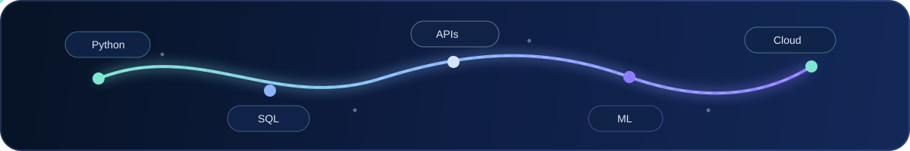

  

  

  
  
  

  
  

## About Me

I am a Software Engineer and Data Analyst with 4+ years of experience across software delivery, analytics, and public-sector systems. I hold a First Class Honours B.Sc. in Computer Science and an M.Sc. in Data Science from the University of British Columbia.

My work sits at the intersection of backend engineering, automation, analytics, and applied machine learning. I enjoy building dependable systems, cleaning up messy workflows, and turning data into decisions people can actually use.

## Current Focus

<table>
  <tr>
    <td width="33%">
      <strong>Current Role</strong> 
      Reviewing model outputs across text, reasoning, and code tasks as a Data Annotator at DataAnnotation.
    </td>
    <td width="33%">
      <strong>What I Build</strong> 
      Backend tools, reporting pipelines, RAG experiments, and practical automation for real-world teams.
    </td>
    <td width="33%">
      <strong>What I Value</strong> 
      Reliable delivery, clear communication, measurable impact, and technology that solves real problems.
    </td>
  </tr>
</table>

## Recent Impact

- Reduced onboarding time by 40% by deploying and maintaining Ubuntu environments for 200+ staff.
- Improved asset tracking and deployment efficiency by 35% through LDAP and Active Directory integrated tooling.
- Helped expand ICT Access Centre services to 8 communities, supporting 1,500+ residents.
- Built an emissions tracking framework that benchmarked at roughly 85% accuracy against existing tools.

  

## Tech Stack

  

  
  
  

## GitHub Snapshot

  
  

  

## Featured Projects

<table>
  <tr>
    <td width="50%">
      <strong>MTR-Framework</strong> 
      Private case study for a Python package that measures and tracks carbon emissions from deep learning workflows using runtime metrics and regional carbon-intensity APIs.
    </td>
    <td width="50%">
      <strong><a href="https://github.com/OAOverflowAnalytics/CSEC-IT-RAG">CSEC-IT-RAG</a></strong> 
      RAG application built to help students understand CSEC Information Technology concepts with separate frontend and backend services and local Ollama-based model support.
    </td>
  </tr>
  <tr>
    <td width="50%">
      <strong><a href="https://github.com/UBC-MDS/dsresumatch">DSResuMatch</a></strong> 
      Python package for comparing resumes and job descriptions through section extraction and keyword relevance scoring.
    </td>
    <td width="50%">
      <strong><a href="https://project-bloodline.web.app/">Project Bloodline</a></strong> 
      Progressive Web Application built with Angular and Flask to encourage blood donation through mobile-ready, REST-backed workflows.
    </td>
  </tr>
  <tr>
    <td width="50%">
      <strong><a href="https://github.com/SimplyTim/Credit-Card-Default-Predictor">Credit Card Default Predictor</a></strong> 
      Ensemble modeling project for predicting credit card default risk from historical payment behavior.
    </td>
    <td width="50%">
      <strong><a href="https://github.com/SimplyTim/NIH-Chest-XRay-Classifier">NIH Chest X-Ray Classifier</a></strong> 
      Deep learning pipeline trained on chest X-rays to identify thoracic diseases using transfer learning and computer vision workflows.
    </td>
  </tr>
</table>

## Education

- M.Sc. in Data Science, University of British Columbia, 2025
- B.Sc. in Computer Science, First Class Honours, University of the West Indies, 2021

## Let's Connect

  
  
  

  <em>"Nothing is more creative... nor destructive... than a brilliant mind with a purpose."</em> 
  - Dan Brown

